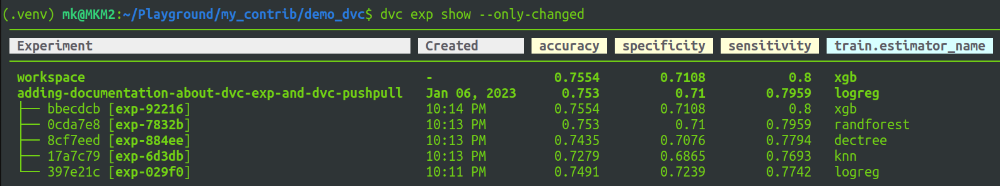

# Simple demonstration about how to use dvc library
## 1. Requirements

### 1.1 Downloading api key from kaggle

Since the data will be downloaded from kaggle, you first need to export your kaggle username and kaggle key as the environment variables like
```
export KAGGLE_USERNAME=*****
export KAGGLE_KEY=***** 
```
This must be done in your <b>command prompt</b>. 
If you don't know how to get KAGGLE_USERNAME and KAGGLE_KEY, you should probably read <b>Generating the API Key</b> section of [this article](https://insaid.medium.com/how-to-access-datasets-directly-from-kaggle-6a3552ea891c).

If you don't want to type your KAGGLE_USERNAME and KAGGLE_KEY everytime, there is another method. You could make a shell script (let's assume your_script.sh) and write the following in your script like
```
#!/bin/sh

export KAGGLE_USERNAME=******
export KAGGLE_KEY=*******
```

Then Run this command in your command prompt like
```
. your_script.sh
```

This approach can have the same effect as the first approach. You don't need to type **export** command everytime and just run the shell script as like that.

Note `export` command will work only for **linux** machines. If you use **window** machine, use `SET` instead of `export` (SET is equivalent of export in window). And also second method will not work in **window** machines. Honestly, I don't know how to write shell script equivalent in window OS.

### 1.2. Installation of dependencies
```
pip install -r requirements.txt
```
You can either install that either in your conda environment or in your python virtual environment. And I used python3.7 for this repository.

If you run in your python virtual environment, then add virtual environment to Jupyter Notebook
```
python -m ipykernel install --user --name=dvc-venv
```

### 1.3. Exporting kaggle keys for github actions (Optional: Need only if you forked this repo)

In order to work properly with github action, **KAGGLE_USERNAME** and **KAGGLE_KEY** from kaggle api or kaggle.json are needed to be added. 

It can be done through Settings -> Secrets(Under the *Security*) -> Actions -> New repository secret and then fill **Name** and **Secret**. Environment variables are needed to be added like that in order to work in github actions. These two environment variables are necessary for data loading stage in data pipeline.

## 2. Processing Pipeline

There are five steps needed to done by this project. First, download the data, select the features,split the data, train the model and evaluate it.
All these five steps can be reproduced by using dvc by this command
```
dvc repro
``` 

In order to run this command, we need to prepare <b>dvc.yaml</b>. In this yaml file, all five stages named **data_get**, **feature_select**, **data_split**, **train** and **evaluate** are well defined by their `cmd`(command), `deps`(dependency), `params`(parameter), `outs`(output),`metrics`(metric) and `plots`(plot).

`dvc repro` is useful for automation of the pipeline. It is also useful for reproducibility of the data pipeline.

## 3. Version Control with dvc

Reproducible ML experiments require versioned data, models and experiments. You should need to avoid manual versioning named like *model.pkl*, *model_logReg.pkl*.

`dvc` works with data in two ways.

1. Automated version of DVC pipeline output (from `dvc repro`)
    - It automatically tracks the file from `deps` and `outs` from dvc.yaml

2. Manually add files and folders for DVC version control with `dvc add` command
    - `dvc add data.xml `

### 3.1. Setup remote storage


```sh
mkdir -p /tmp/dvc
dvc remote add -d myremote /tmp/dvc
git commit .dvc/config -m "configure local remote"
```

The above commands will setup remote storage in your local folder named */tmp/dvc* . You can also setup remote storages in Google drive, Amazon S3 etc. For more info --> [here](https://dvc.org/doc/use-cases/versioning-data-and-models/tutorial)

### 3.2. Push updated data or model to remote storage

```sh
dvc push
```

### 3.3. Pull data from remote storage

```sh
dvc pull
```

It is so helpful if you accidently delete some data.

### 3.4. Track status of the data and models

```sh
dvc status
```

### 3.5. Switching versions

You need to add versioning with `git tag` to give version number. Then you can switch versioning.
First, use `git checkout` and then `dvc checkout`.

```sh
git checkout v1.0
dvc checkout data.dvc
```

## 4. Visualizing metrics and plots

### 4.1. Visualizing metrics

It is vital to have *reproducible pipelines* so that we can easily *manage experiments*. We also need to evaluate  experiments by their resulting metrics such as accuracy. That's why metrics are a requirement for experiment management.

When dvc is used, we can add structured metrics  as an output of our reproducible pipeline and can also visualize the metrics. 

To track the metrics, we need to add `metrics` parameter in the stage (evaluate stage in demo) of dvc.yaml. We also need to give `cache: false` to that. Then we can track the experiment result by using 

```sh
dvc metrics show
```

Another useful command is `dvc metrics diff`. This command shows the difference between the experiments. In order to work properly with this command, you need to track the **log file** associated with accuracy (**report/report.json** in my demo) with **git**. If that log file is ignored by git (I mean if entire folder is added in **.gitignore**), you will get the blank value in `head` column.

### 4.2 Visualizing Plots

In most of the cases, visualizing only metrics is not enough. We also need to visualize the plots too. 

In my demo, the pipeline can generate the confusion matrix by using **seaborn** library. But there is another way we can generate this by using dvc. In order to do that, we just need a *csv* which consists of two columns (predicted value and true value for target column) with their respective value. Then the command that can generate the plot is 

```sh
## template format is for confusion matrix and x-axis is the column 
## named y_pred for predicted value and y-axis is y_test for true value 
## which are from the file named confusion_matrix_data.csv inside report.
dvc plots show report/confusion_matrix_data.csv --template confusion -x y_pred -y y_test 
```

## 5. Managing Experiments

`dvc exp run` can be used to run experiments. 

### 5.1. Modify parameters on-the-fly

For example, in my demo, there are five different models in my configuration file, **params.yaml** (check **estimators** from **train** section). You can run each experiment without editing value in **params.yaml** with `dvc exp run` command. -S means --set-param

```sh
# to run logistic regression
dvc exp run -S train.estimator_name=logreg

## to run knn
dvc exp run -S train.estimator_name=knn

## to run decision tree
dvc exp run -S train.estimator_name=dectree

## to run random forest
dvc exp run -S train.estimator_name=randforest

## to run xgb
dvc exp run -S train.estimator_name=xgb
```

Not only the model names but also different parameters of each model can be tested too.

### 5.2. Navigating the experiment

Use `dvc exp show --only-changed` to check the results of different experiments.



It can be seen that the performance of **XGBoost** model is better than any other models. (Please check  the lines with `[exp-****]`)

### 5.3. Making the experiment persistent

Since **XGBoost** model has the best performance, we want to apply that experiment.

```sh
dvc exp apply exp-92216
```

**exp-92216** is the ID of the experiment with XGBoost(xgb) model.

### 5.4. Make a branch from the experiment

If we also want to keep the second best experiment (in my demo, random forest has the second best accuracy) as another branch, we can also do that with `dvc exp branch`.

```sh
dvc exp branch exp-7832b rand-forest
```
**exp-7832b** is the ID of the experiment with random forest(randforest) model. The new branch will be named as **rand-forest**.

## CI (Continous Integration)

For CI, ci.yaml is created inside `.github/workflows` folder. You can write certain commands from **cml** library to output your model result  to readme file and also can check the error inside your pipeline.

## Please do star this repository if you know something useful from here.
